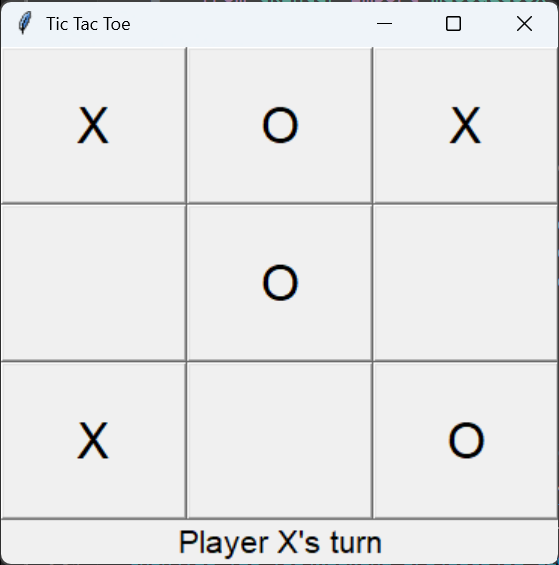
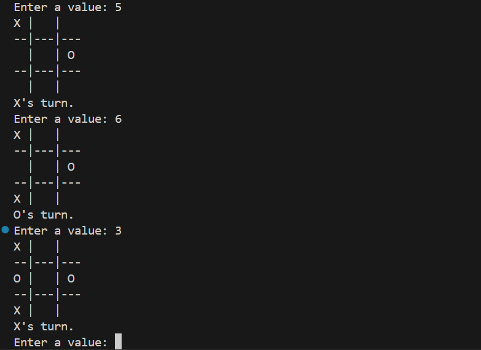

# 🎮 Tic Tac Toe

This project contains two implementations of the classic Tic Tac Toe game built using Python.

## 📂 Versions

* **Terminal Version** – A command-line implementation focusing on game logic.
* **Tkinter Version** – A graphical version built with Tkinter featuring an interactive interface.

## 🛠️ Tech Stack

* Python
* Tkinter

## 🚀 Run

### Terminal Version

```bash
python main.py
```

### Tkinter Version

```bash
python gui.py
```

## 📸 Screenshots

<p align="center">
   
  
  
</p>
